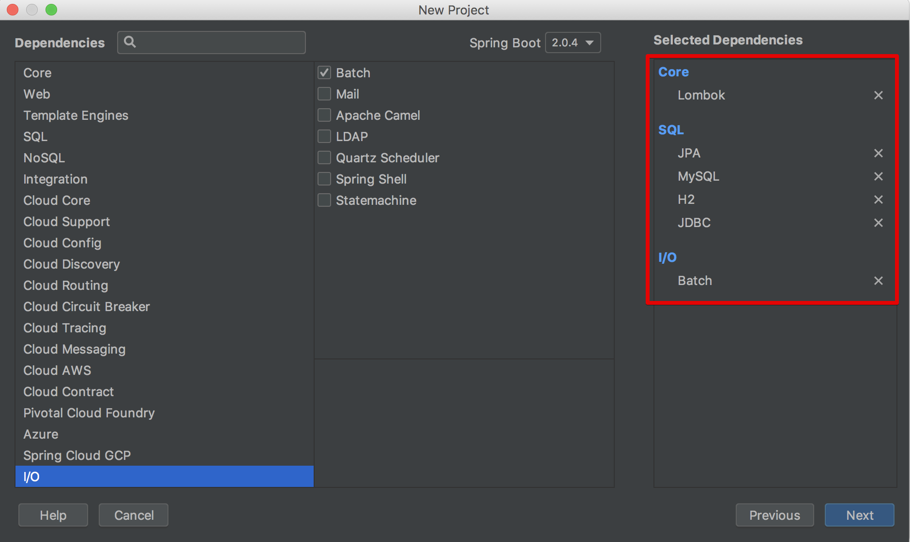
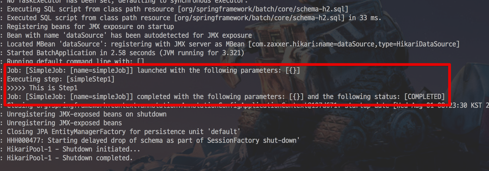

# 2. Batch Job 실행해보기

작업한 모든 코드는 [Github](https://github.com/jojoldu/spring-batch-in-action)에 있으니 참고하시면 됩니다.  

## 2-1. Spring Batch 프로젝트 생성하기

기본적인 프로젝트 개발 환경은 다음과 같습니다.

* IntelliJ IDEA 2018.2
* Spring Boot 2.0.4
* Java8
* Gradle

> lombok 기능을 많이 사용합니다.  
lombok 플러그인을 본인의 IDE에 맞게 설치하시면 좋습니다 :)

이를 기반으로 프로젝트 생성을 시작하겠습니다.  
저는 IntelliJ Ultimate (유료) 버전에서 실행하겠습니다.  
먼저 Spring Boot 프로젝트를 나타내는 Spring Initializr 를 선택합니다.


본인만의 Group, Artifact 를 선택하시고 Gradle 프로젝트를 선택합니다.  
이후 Spring 의존성을 선택하는 화면에선 아래와 같이 선택합니다.



> 만약 본인의 프로젝트가 JPA만 쓰고 있다면 JDBC를 선택하지 않으셔도 됩니다.  
혹은 JPA를 쓰지 않는다면 JPA를 선택하지 않으셔도 됩니다.

build.gradle은 아래와 같은 형태가 됩니다.

```groovy
buildscript {
    ext {
        springBootVersion = '2.0.4.RELEASE'
    }
    repositories {
        mavenCentral()
    }
    dependencies {
        classpath("org.springframework.boot:spring-boot-gradle-plugin:${springBootVersion}")
    }
}

apply plugin: 'java'
apply plugin: 'eclipse'
apply plugin: 'org.springframework.boot'
apply plugin: 'io.spring.dependency-management'

group = 'com.jojoldu.spring'
version = '0.0.1-SNAPSHOT'
sourceCompatibility = 1.8

repositories {
    mavenCentral()
}


dependencies {
    compile('org.springframework.boot:spring-boot-starter-batch')
    compile('org.springframework.boot:spring-boot-starter-data-jpa')
    compile('org.springframework.boot:spring-boot-starter-jdbc')
    runtime('com.h2database:h2')
    runtime('mysql:mysql-connector-java')
    compileOnly('org.projectlombok:lombok')
    testCompile('org.springframework.boot:spring-boot-starter-test')
    testCompile('org.springframework.batch:spring-batch-test')
}

```

> group은 본인만의 group으로 사용하시면 됩니다.


자 그럼 이제 간단한 Spring Batch Job을 생성해보겠습니다.

## 2-2. Simple Job 생성하기

BatchApplication.java에 다음과 같이 Spring Batch 기능 활성화 어노테이션을 추가합니다.


```java
@EnableBatchProcessing
```

자 그리고 패키지 아래에 ```job``` 패키지를 생성하고, ```SimpleJobConfiguration.java``` 를 생성합니다.


 ```simpleJob``` 이란 이름의 간단한 Spring Batch 코드를 작성해봅니다.

```java

@Slf4j // log 사용을 위한 lombok 어노테이션
@RequiredArgsConstructor // 생성자 DI를 위한 lombok 어노테이션
@Configuration
public class SimpleJobConfiguration {
    private final JobBuilderFactory jobBuilderFactory; // 생성자 DI 받음
    private final StepBuilderFactory stepBuilderFactory; // 생성자 DI 받음

    @Bean
    public Job simpleJob() {
        return jobBuilderFactory.get("simpleJob")
                .start(simpleStep1())
                .build();
    }

    @Bean
    public Step simpleStep1() {
        return stepBuilderFactory.get("simpleStep1")
                .tasklet((contribution, chunkContext) -> {
                    log.info(">>>>> This is Step1");
                    return RepeatStatus.FINISHED;
                })
                .build();
    }
}
```


