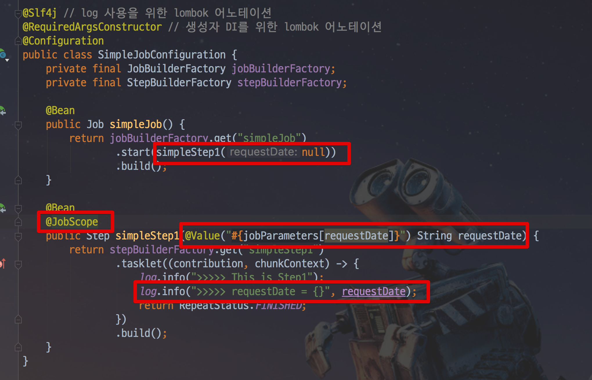
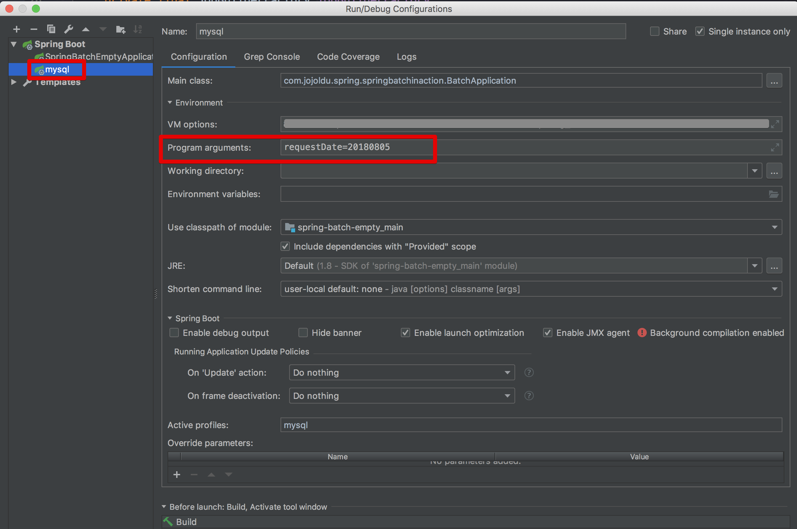

# 3. Spring Batch 메타 테이블 엿보기

이번 시간에는 Spring Batch의 메타 테이블에 대해 좀 더 자세히 살펴보겠습니다.

> 작업한 모든 코드는 [Github](https://github.com/jojoldu/spring-batch-in-action)에 있으니 참고하시면 됩니다.  

## 3-1. Spring Batch 메타 테이블 엿보기

> 이전 시간에 실행한 MySQL용 Spring Batch 코드를 보면서 이 글을 보시면 더욱 도움이 되실것 같습니다.  

먼저 볼 것은 ```BATCH_JOB_INSTANCE``` 입니다.  
본인의 MySQL에서 테이블 조회를 해보면 아래와 같이 1개의 ROW가 검색이 됩니다.기


* ```JOB_INSTANCE_ID```
    * ```BATCH_JOB_INSTANCE``` 테이블의 PK
* ```JOB_NAME```
    * 수행한 Batch Job Name

방금 실행했던 simpleJob이 있는 것을 볼 수 있습니다.  
BATCH_JOB_INSTANCE 테이블은 **Job Parameter에 따라 생성되는 테이블**입니다.  
이 Job Parameter가 생소할텐데요.  
간단하게 말씀드리면, **Spring Batch가 실행될때 외부에서 받을 수 있는 파라미터**입니다.  
  
예를 들어, 특정 날짜를 Job Parameter로 넘기면 Spring Batch에서는 받은 날짜의 데이터를 조회/가공/입력 등의 작업을 할 수 있습니다.  

같은 Batch Job 이라도 Job Parameter가 다르면 ```Batch_JOB_INSTANCE```에는 기록되며, **Job Parameter가 같다면 기록되지 않습니다**.  
  
한번 확인해볼까요?  
simpleJob 코드를 아래와 같이 수정합니다.



```java
@Slf4j // log 사용을 위한 lombok 어노테이션
@RequiredArgsConstructor // 생성자 DI를 위한 lombok 어노테이션
@Configuration
public class SimpleJobConfiguration {
    private final JobBuilderFactory jobBuilderFactory;
    private final StepBuilderFactory stepBuilderFactory;

    @Bean
    public Job simpleJob() {
        return jobBuilderFactory.get("simpleJob")
                .start(simpleStep1(null))
                .build();
    }

    @Bean
    @JobScope
    public Step simpleStep1(@Value("#{jobParameters[requestDate]}") String requestDate) {
        return stepBuilderFactory.get("simpleStep1")
                .tasklet((contribution, chunkContext) -> {
                    log.info(">>>>> This is Step1");
                    log.info(">>>>> requestDate = {}", requestDate);
                    return RepeatStatus.FINISHED;
                })
                .build();
    }
}
```

빨간색 표기된 코드만 추가되었으니 그대로 변경하시면 됩니다.

> Batch Job Parameter는 이후 챕터에서 좀 더 자세히 소개드리겠습니다.  
지금은 메타 테이블에 대한 이해를 위한 샘플 코드이니 **이렇게 하면 Job Parameter를 사용할 수 있다 정도로만** 이해하시면 됩니다. :)

자 그럼 이제 Job Parameter를 넣어서 Batch 를 실행해보겠습니다.  
좀 전과 마찬가지로 본인의 IDE 실행환경 탭을 클릭해서 설정창으로 갑니다.


아래와 같이 **Program arguments**에 ```requestDate=20180805``` 를 입력합니다.



저장 하시고, 다시 실행을 해봅니다.  
그러면!  
Job Parameter가 아주 잘 전달되어 로그가 찍힌것을 볼 수 있습니다.


BATCH_JOB_INSTANCE을 다시 볼까요?


새로운 Job Instance가 추가되었습니다!  
자 그럼 진짜 Job Parameter 가 같으면 새로 생성되지 않는지 볼까요?  
같은 파라미터로 다시 한번 IDE에서 Batch 를 실행해봅니다.


JobInstanceAlreadyCompleteException 라는 Exception과 함께 에러 메세지가 있습니다.  

```
A job instance already exists and is complete for parameters={requestDate=20180805}.  If you want to run this job again, change the parameters.
```

같은 파라미터로는 Job을 실행시킬수 없다고 하죠?  
파라미터를 변경해서 실행해보겠습니다.  
이번에는 ```requestDate=20180806``` 으로 합니다.


정상적으로 수행되었고, ```BATCH_JOB_INSTANCE``` 테이블에도 정상적으로 추가 생성되었습니다!


## 2-5. Spring Batch Test 코드는?

저의 이전 [Spring Batch 글](http://jojoldu.tistory.com/search/batch)을 보시면 아시겠지만, 저는 Spring Batch 예제를 항상 테스트 코드로 작성했습니다.  
그러다보니 **develop/production 환경에서 Spring Batch를 사용하시는 분들이 Batch Job Intstance Context 문제로 어려움을 겪는걸 많이 봤습니다**.  
Spring Batch에 적응하시기 전까지는 H2를 이용한 테스트 코드는 자제하시길 추천합니다.  
그래서 H2를 이용한 테스트 코드는 최대한 나중에 보여드리겠습니다.  
초반부에는 MySQL을 이용하면서 Spring Batch에 최대한 적응하시도록 진행하겠습니다.
