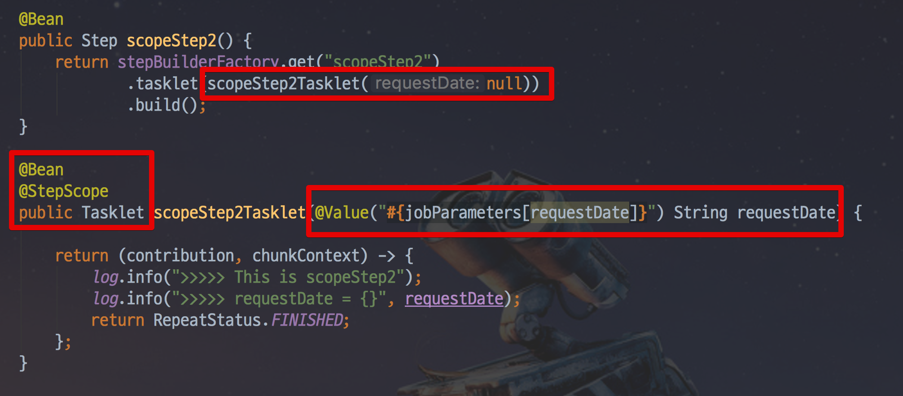

# 5. Spring Batch Scope & Job Parameter

이번 시간에는 Spring Batch의 Scope에 대해서 배워보겠습니다.  
여기서 말하는 Scope란 ```@StepScope```, ```@JobScope```를 얘기하는데요.  
무의식적으로 사용하는 이 어노테이션들이 실제로 어떤 일들을 하는지 알아보겠습니다.  
그리고 이 둘과 떨어질 수 없는 **Job Parameter**도 함께 배워보겠습니다.

## 5-1. JobParameter와 Scope

Spring Batch의 경우 외부 혹은 내부에서 파라미터를 받아 여러 Batch 컴포넌트에서 사용할 수 있게 지원하고 있습니다.  
이 파라미터를 **Job Parameter**라고 합니다.  
Job Parameter를 사용하기 위해선 항상 Spring Batch 전용 Scope를 선언해야만 하는데요, ```@StepScope```와 ```@JobScope``` 2가지가 있습니다.  
사용법은 간단합니다.  
아래 코드와 같이 SpEL 로 선언해서 사용하시면 됩니다.

```java
@Value("#{jobParameters[파라미터명]}") 타입 변수명
```

> jobParameters 외에도 ```jobExecutionContext```, ```stepExecutionContext``` 등 Spring Batch 메타 데이터도 SpEL로 사용할 수 있습니다.  

각각의 Scope에서 사용하는 샘플 코드는 아래와 같습니다.  
  
**JobScope**


**StepScope**



**@JobScope는 Step 선언문에서** 사용가능하고, **@StepScope는 Taskler이나 ItemReader, ItemWriter, ItemProcessor**에서 사용할 수 있습니다.  
  
보시면 굉장히 신기한 것이 호출하는 쪽에서 ```null``` 를 할당하고 있는데요.  
이는 **Job Parameter의 할당이 어플리케이션 실행시에 하지 않기 때문**입니다.   
자 이게 무슨 이야기인지 좀 더 자세히 들어가보겠습니다.

## 5-2. @StepScope & @JobScope 소개

Spring Batch는 ```@StepScope```와 ```@JobScope``` 라는 아주 특별한 Bean Scope를 지원합니다. 
아시다시피, **Spring Bean의 기본 Scope는 singleton**인데요.  
그러나 아래처럼 Spring Batch 컴포넌트 (Tasklet, ItemReader, ItemWriter, ItemProcessor 등)에 ```@StepScope```를 사용하게 되면 


Spring Batch가 Spring 컨테이너를 사용하여 지정된 **Step의 실행시점에 해당 컴포넌트를 Spring Bean으로 생성**합니다.  
마찬가지로 ```@JobScpoe```는 **Job 실행시점**에 Bean이 생성 됩니다.  
즉, **Bean의 생성 시점을 지정된 Scope가 실행되는 시점으로 지연**시킵니다.  

> 어떻게 보면 MVC의 request scope와 비슷할 수 있겠습니다.  
request scope가 request가 왔을때 생성되고, response를 반환하면 삭제되는것처럼, JobScope, StepScope 역시 Job이 실행되고 끝날때, Step이 실행되고 끝날때 생성/삭제가 이루어진다고 보시면 됩니다.  
  
이렇게 Bean의 생성시점을 어플리케이션 실행 시점이 아닌, Step 혹은 Job의 실행시점으로 지연시키면서 얻는 장점은 크게 2가지가 있습니다.  
  
첫째로, **JobParameter의 Late Binding**이 가능합니다.  
Job Parameter가 StepContext 또는 JobExecutionContext 레벨에서 할당시킬 수 있습니다.  
즉, 꼭 Application이 실행되는 시점 외에 **메소드가 실행되는 시점에 Job Parameter를 할당**시킬 수 있습니다.  
이 부분은 아래에서 좀 더 자세하게 예제와 함께 설명드리겠습니다.  
  
두번째로, 동일한 컴포넌트를 병렬 혹은 동시에 사용할때 유용합니다.  
Step 안에 Tasklet이 있고, 이 Tasklet은 멤버 변수와 이 멤버 변수를 변경하는 로직이 있다고 가정해봅시다.  
이 경우 ```@StepScope``` 없이 Step을 병렬로 실행시키게 되면 **서로 다른 쓰레드에서 하나의 Tasklet을 두고 마구잡이로 상태를 변경**하려고 할것입니다.  
하지만 ```@StepScope```가 있다면 **각각의 Step에서 별도의 Tasklet을 생성하고 관리하기 때문에 서로의 상태를 침범할 일이 없습니다**.  
  
자 그럼 Late Binding이 뭘까요?

## 5-3. Late Binding (늦은 할당)

Spring Batch를 CommandLineRunner로만 실행해보신 분들은 아닐 수 있지만, 웹 서버에서 Batch를 실행하시거나, 테스트 코드를 통해 Batch를 실행해보신 분들은 Late Binding에 대해 어렴풋이 사용하고 계셨을 수 있습니다.  
  


```java

@Slf4j
@RequiredArgsConstructor
@RestController
public class JobLauncherController {
  
    private final JobLauncher jobLauncher;
    private final Job job;
     
    @GetMapping("/launchjob")
    public String handle(@RequestParam("fileName") String fileName) throws Exception {
  
        try {
            JobParameters jobParameters = new JobParametersBuilder()
                                    .addString("input.file.name", fileName)
                                    .addLong("time", System.currentTimeMillis())
                                    .toJobParameters();
            jobLauncher.run(job, jobParameters);
        } catch (Exception e) {
            log.info(e.getMessage());
        }
  
        return "Done";
    }
}
```

## 5-4. JobParameter vs 시스템 변수

앞의 이야기를 보면서 아마 이런 의문이 있을 수 있습니다.  

* 왜 꼭 Job Parameter를 써야하지?  
* 기존에 Spring Boot에서 사용하던 여러 환경변수 혹은 시스템 변수를 사용하면 되지 않나?
* CommandLineRunner를 사용한다면 ```java jar application.jar -D파라미터```로 시스템 변수를 지정하면 되지 않나?

자 그래서 왜 Job Parameter를 써야하는지 설명드리겠습니다.  
아래 2가지 코드를 한번 보겠습니다.

### JobParameter

```java
@Bean
@StepScope
public FlatFileItemReader<Partner> reader(
        @Value("#{jobParameters[pathToFile]}") String pathToFile){
    FlatFileItemReader<Partner> itemReader = new FlatFileItemReader<Partner>();
    itemReader.setLineMapper(lineMapper());
    itemReader.setResource(new ClassPathResource(pathToFile));
    return itemReader;
}
```

### 시스템 변수

> 여기에서 얘기하는 시스템 변수는 application.properties와 ```-D``` 옵션으로 실행하는 변수까지 포함합니다.

```java
@Bean
@ConfigurationProperties(prefix = "my.prefix")
protected class JobProperties {

    String pathToFile;

    ...getters/setters
}

@Autowired
private JobProperties jobProperties;

@Bean
public FlatFileItemReader<Partner> reader() {
    FlatFileItemReader<Partner> itemReader = new FlatFileItemReader<Partner>();
    itemReader.setLineMapper(lineMapper());
    String pathToFile = jobProperties.getPathToFile();
    itemReader.setResource(new ClassPathResource(pathToFile));
    return itemReader;
}
```

위 2가지 방식에는 몇 가지 차이점이 있습니다.  
  
일단 첫번째로, 시스템 변수를 사용할 경우 **Spring Batch의 Job Parameter 관련 기능을 못쓰게** 됩니다.  
예를 들어, Spring Batch는 **같은 JobParameter로 같은 Job을 두 번 실행하지 않습니다**.  
하지만 시스템 변수를 사용하게 될 경우 이 기능이 전혀 작동하지 않습니다.  
또한 Spring Batch에서 자동으로 관리해주는 Parameter 관련 메타 테이블이 전혀 관리되지 않습니다.  
  
둘째, Command line이 아닌 다른 방법으로 Job을 실행하기가 어렵습니다.  
만약 실행해야한다면 **전역 상태 (시스템 변수 혹은 환경 변수)를 동적으로 계속해서 변경시킬 수 있도록** Spring Batch를 구성해야합니다.  
동시에 여러 Job을 실행하려는 경우 또는 테스트 코드로 Job을 실행해야할때 문제가 발생할 수 있습니다.  
  
셋째, Bean의 범위가 서로 다릅니다.  
첫번째 예제는 Bean의 범위가 ```Step``` 입니다.  
두번째 예제는 Bean의 범위가 ```singleton``` 입니다.
 
첫번째의 경우 Bean을 요청하는 **모든 Step에서 새 인스턴스가 생성** 됩니다.  
두번째의 경우 Bean의 인스턴스는 **어플리케이션에서 하나만 존재**합니다.  


## 5-5. 주의 사항

코드를 보시면 아시겠지만, ```@Bean```과 ```@StepScope```를 함께 쓰는 것은 ```@Scope (value = "step", proxyMode = TARGET_CLASS)```로 표시하는 것과 같습니다.


이 proxyMode로 인해서 문제가 발생할 수 있습니다.  
어떤 문제가 있고, 어떻게 해결하면 될지는 이전에 작성된 [@StepScope 사용시 주의 사항](http://jojoldu.tistory.com/132)을 꼭! 참고해보세요.

