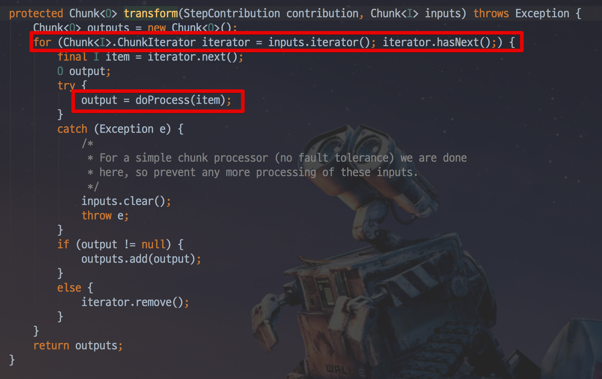
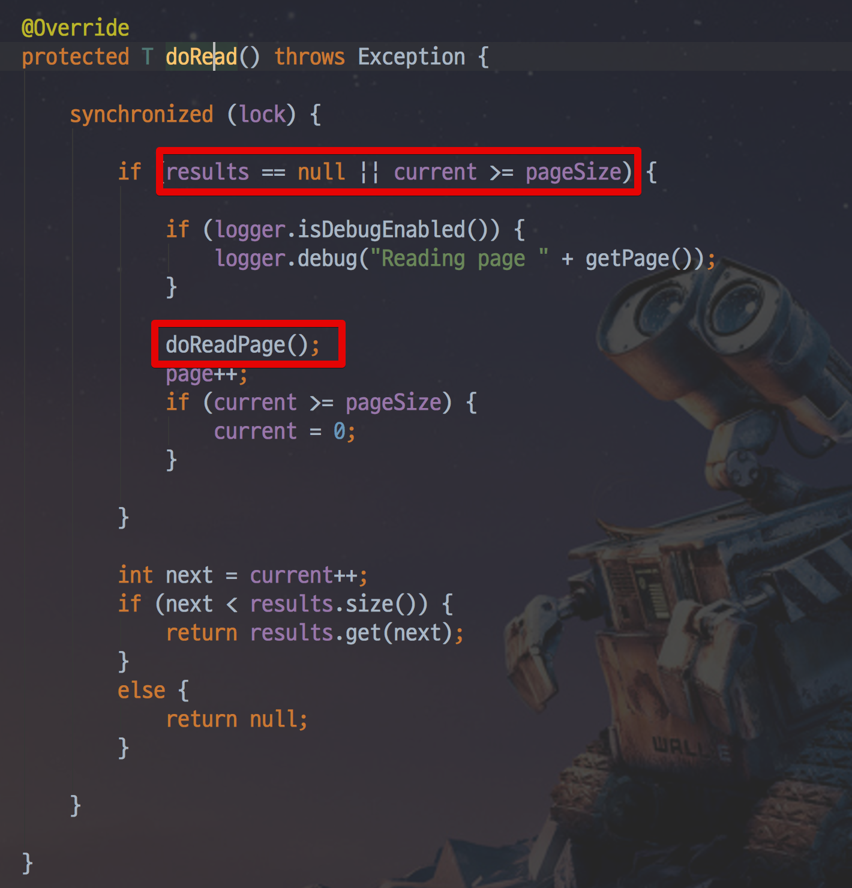

# 6. Chunk 지향 처리
 
Spring Batch를 쓰는 가장 큰 이유로 Chunk를 얘기합니다.  
이번 시간에는 Chunk가 무엇인지 한번 살펴보겠습니다.

## 6-1. Chunk?

Spring Batch는 **Chunk 지향 처리** 스타일을 사용하고 권장합니다.  
Spring Batch에서의 Chunk란 데이터 덩어리로 작업 할 때 **각 커밋 사이에 처리되는 row 수**를 얘기합니다.  
즉, Chunk 지향 처리란 **한 번에 하나씩 데이터를 읽어 Chunk라는 덩어리를 만든 뒤, Chunk 단위로 트랜잭션**을 다루는 것을 의미합니다.  
  
여기서 트랜잭션이라는게 중요한데요.  
Chunk 단위로 트랜잭션을 수행하기 때문에 **실패할 경우엔 해당 Chunk 만큼만 롤백**이 되고, 이전에 커밋된 트랜잭션 범위까지는 반영이 된다는 것입니다.  
  


Chunk 지향 처리를 Java 코드로 표현하면 아래처럼 될 것 같습니다.

```java

for(int i=0; i<totalSize; i+=chunkSize){ // chunkSize 단위로 묶어서 처리
    List items = new Arraylist();
    for(int j = 0; j < chunkSize; j++){
        Object item = itemReader.read()
        Object processedItem = itemProcessor.process(item);
        items.add(processedItem);
    }
    itemWriter.write(items);
}

```

> 개인적인 생각이지만 [Spring Batch 공식 문서의 그림과 예제코드](https://docs.spring.io/spring-batch/4.0.x/reference/html/index-single.html#chunkOrientedProcessing)는 오해의 소지가 있다고 생각합니다.  
Chunk 내부의 그림만 있어서 큰 그림에서 Chunk 단위로 처리되는 내용이 없습니다.  


### SimpleChunkProcessor 엿보기

Chunk 지향 처리의 전체 로직을 담고 있는 것이 ```SimpleChunkProcessor``` 입니다.  


 ```transform()``` 에서는 조회된 chunk size만큼의 item을 ```doProcess()```로 전달하고 변환값을 받습니다.




## 6-2. Page Size vs Chunk Size

기존에 Spring Batch를 사용해보신 분들은 아마 PagingItemReader를 많이들 사용해보셨을것 같습니다.  
간혹 Page Size와 Chunk Size를 같은 의미로 오해하시는 분들이 계시는데요.  
**Page Size와 Chunk Size는 서로 의미하는 바가 완전히 다릅니다**.  

> 물론 Page Size와 Chunk Size값을 일치시켜야만 **JPA의 영속성 컨텍스트가 깨지지 않습니다**.  
이전에 관련해서 [문제를 정리](http://jojoldu.tistory.com/146)했으니 참고해보세요.  
하지만 이건 어디까지 JPA에서의 문제이지 Page Size와 Chunk Size가 같은 의미라는건 아닙니다.

Chunk Size는 한번에 처리될 트랜잭션 단위를 얘기하며, **Page Size는 한번에 조회할 Item의 양**을 얘기합니다.  


doRead에서는 현재 읽어올 데이터가 없거나, Page Size를 초과한 경우 ```doReadPage()```를 호출합니다.  
읽어올 데이터가 없는 경우는 read가 처음 시작할 때를 얘기합니다.  
Page Size를 초과하는 경우는 예를 들면 Page Size가 10인데, 이번에 읽어야할 데이터가 11번째 데이터라면 Page Size를 초과했기 때문에 ```doReadPage()``` 를 호출한다고 보시면 됩니다.  
즉, Page 단위로 끊어서 조회하는 것입니다.  



doReadPage에서는 Reader에서 지정한 Page Size만큼 ```offset```, ```limit``` 쿼리를 생성하여 조회를 하고 그만큼을 ```results```에 저장합니다.

