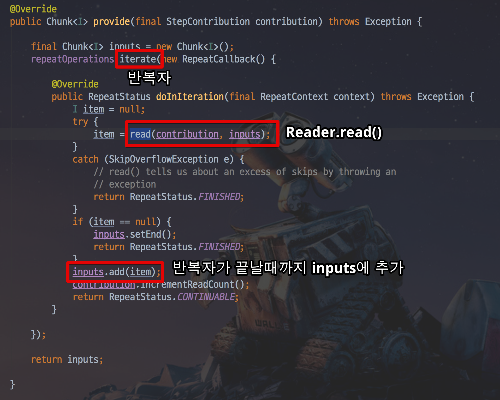
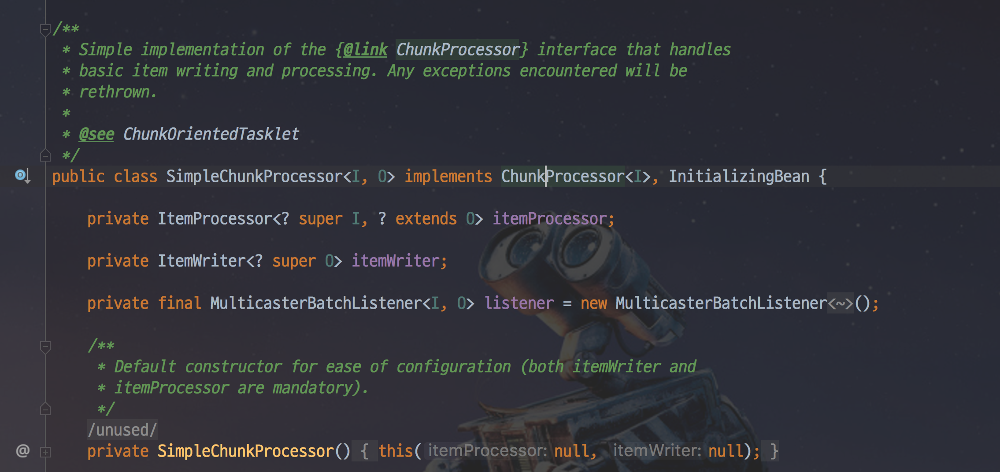
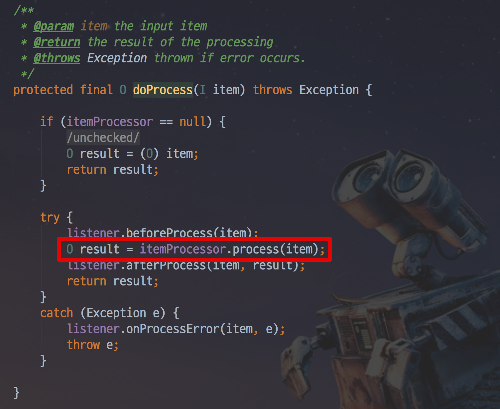
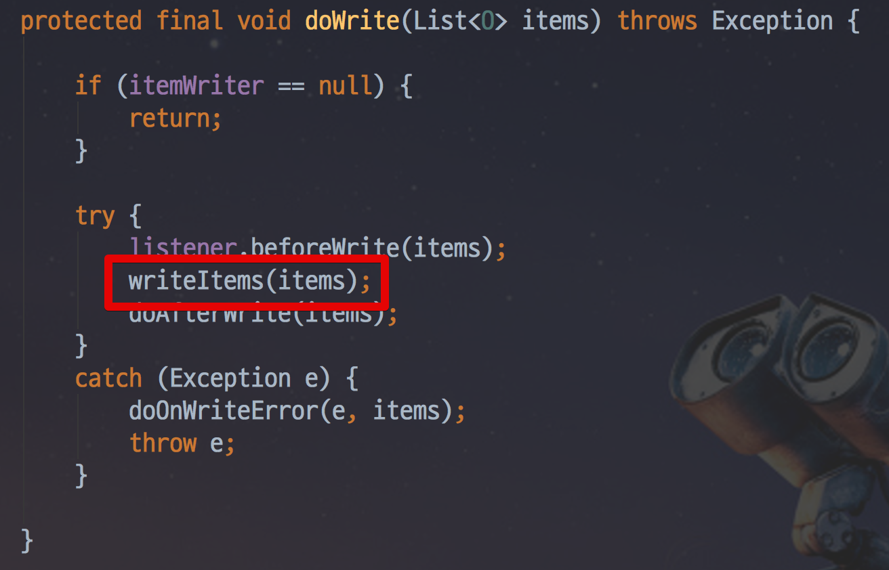

# 6. Chunk 지향 처리
 
Spring Batch를 쓰는 가장 큰 이유로 Chunk를 얘기합니다.  
이번 시간에는 Chunk가 무엇인지 한번 살펴보겠습니다.

## 6-1. Chunk?

Spring Batch는 **Chunk 지향 처리** 스타일을 사용하고 권장합니다.  
Spring Batch에서의 Chunk란 데이터 덩어리로 작업 할 때 **각 커밋 사이에 처리되는 row 수**를 얘기합니다.  
즉, Chunk 지향 처리란 **한 번에 하나씩 데이터를 읽어 Chunk라는 덩어리를 만든 뒤, Chunk 단위로 트랜잭션**을 다루는 것을 의미합니다.  
  
여기서 트랜잭션이라는게 중요한데요.  
Chunk 단위로 트랜잭션을 수행하기 때문에 **실패할 경우엔 해당 Chunk 만큼만 롤백**이 되고, 이전에 커밋된 트랜잭션 범위까지는 반영이 된다는 것입니다.  
  
Chunk 지향 처리가 결국 Chunk 단위로 데이터를 처리한다는 의미이기 때문에 그림으로 표현하면 아래와 같습니다.
  


> [공식 문서의 그림](https://docs.spring.io/spring-batch/4.0.x/reference/html/index-single.html#chunkOrientedProcessing)은 **개별 item이 처리되는 것만** 다루고 있습니다.
위 그림은 Chunk 단위까지 다루고 있어 조금 다르니 주의해주세요.

Reader에서 데이터를 하나 읽어와 Processor에서 가공 후, 별도의 공간에 모은뒤, **Chunk 단위만큼 쌓이게 되면 Writer에 전달**하고 Writer는 일괄 저장합니다.  
  
Reader와 Processor에서는 1건씩 다뤄지고, Writer에선 Chunk 단위로 처리된다는 것만 기억하시면 됩니다.  
  
Chunk 지향 처리를 Java 코드로 표현하면 아래처럼 될 것 같습니다.

```java

for(int i=0; i<totalSize; i+=chunkSize){ // chunkSize 단위로 묶어서 처리
    List items = new Arraylist();
    for(int j = 0; j < chunkSize; j++){
        Object item = itemReader.read()
        Object processedItem = itemProcessor.process(item);
        items.add(processedItem);
    }
    itemWriter.write(items);
}

```

여기서 Spring Batch를 한번 써보신 분들은 제 이야기에 한가지 의문이 들 수 있습니다.  

* Reader에서 하나씩 읽는게 맞나?
* **Reader에서 대량으로 읽고** Processor에 하나씩 전달하는게 아니였나?

자 그럼 어느게 맞는지 Spring Batch 내부 코드를 확인해보겠습니다.

## 6-2. ChunkOrientedTasklet 엿보기

Chunk 지향 처리의 전체 로직을 다루는 것이 ```ChunkOrientedTasklet``` 입니다.  


여기서 실제로 보셔야하는 곳은 ```execute()``` 입니다.


* ```chunkProvider.provide()```로 Reader에서 Chunk size만큼 데이터를 가져옵니다.
* ```chunkProcessor.process()``` 에서 Reader로 받은 데이터를 가공(Processor)하고 저장(Writer)합니다.



ChunkSize만큼 ```inputs```가 쌓일때까지 계속 해서 ItemReader.read를 호출하여 데이터를 읽어옵니다.

## 6-3. SimpleChunkProcessor 엿보기

Processor와 Writer 로직을 담고 있는 것이 ```ChunkProcessor``` 입니다.  


인터페이스이기 때문에 실제 구현체가 있어야 하는데요.  
보편적으로 사용되는 것이 ```SimpleChunkProcessor``` 입니다.  



위 클래스를 보시면 Spring Batch에서 Chunk 단위 처리를 어떻게 하는지 아주 상세하게 확인할 수 있습니다.  
  
여기서 핵심 로직은 ```process()``` 에 담겨 있습니다.  
SimpleChunkProcessor의 ```process()```를 찾아보시면


* ```Chunk<I> inputs```를 파라미터로 받습니다.
    * 

 ```transform()``` 에서는 조회된 chunk size만큼의 item을 ```doProcess()```로 전달하고 변환값을 받습니다.







## 6-4. Page Size vs Chunk Size

기존에 Spring Batch를 사용해보신 분들은 아마 PagingItemReader를 많이들 사용해보셨을것 같습니다.  
간혹 Page Size와 Chunk Size를 같은 의미로 오해하시는 분들이 계시는데요.  
**Page Size와 Chunk Size는 서로 의미하는 바가 완전히 다릅니다**.  

> 물론 Page Size와 Chunk Size값을 일치시켜야만 **JPA의 영속성 컨텍스트가 깨지지 않습니다**.  
(이전에 관련해서 [문제를 정리](http://jojoldu.tistory.com/146)했으니 참고해보세요.)  
하지만 이건 어디까지 JPA에서의 문제이지 Page Size와 Chunk Size가 같은 의미라는건 아닙니다.

Chunk Size는 한번에 처리될 트랜잭션 단위를 얘기하며, **Page Size는 한번에 조회할 Item의 양**을 얘기합니다.  


doRead에서는 현재 읽어올 데이터가 없거나, Page Size를 초과한 경우 ```doReadPage()```를 호출합니다.  
읽어올 데이터가 없는 경우는 read가 처음 시작할 때를 얘기합니다.  
Page Size를 초과하는 경우는 예를 들면 Page Size가 10인데, 이번에 읽어야할 데이터가 11번째 데이터라면 Page Size를 초과했기 때문에 ```doReadPage()``` 를 호출한다고 보시면 됩니다.  
즉, Page 단위로 끊어서 조회하는 것입니다.  


doReadPage에서는 Reader에서 지정한 Page Size만큼 ```offset```, ```limit``` 쿼리를 생성하여 조회를 하고 그만큼을 ```results```에 저장합니다.


JPA를 쓰지 않더라도 PageSize와 ChunkSize는 일치시키는게 마음편하니 맞추시길 추천합니다.