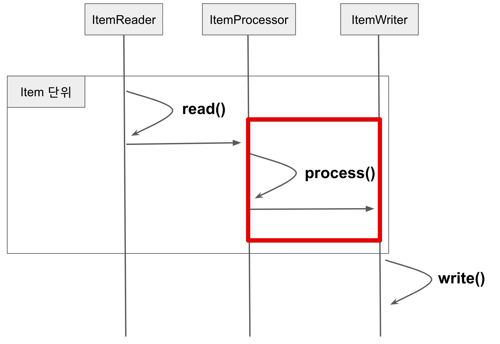
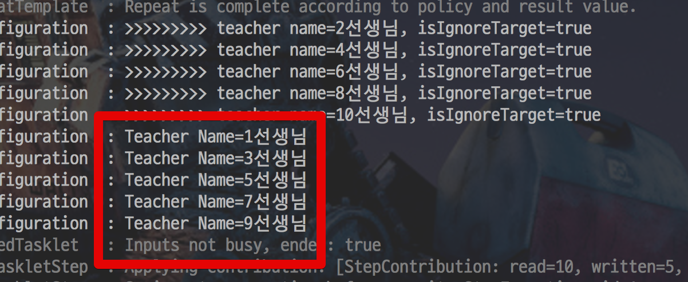

# 9. ItemProcessor

7,8 장에서는 Chunk 지향 처리에서의 데이터 읽기와 쓰기 부분을 소개 드렸습니다.  
이번 챕터에서는 읽기와 쓰기가 아닌, **가공 (혹은 처리) 단계**를 소개드리겠습니다.  
바로 **ItemProcessor**입니다.  

여기서 한가지 드리고 싶은 말씀은 **ItemProcessor는 필수가 아니라는 점**입니다.  
ItemProcessor는 데이터를 가공하거나 필터링하는 역할을 합니다.  
이는 **Writer 부분에서도 충분히 구현 가능**합니다.  

그럼에도 ItemProcessor를 쓰는 것은 Reader, Writer 와는 별도의 단계로 분리되었기 때문에 **비지니스 코드가 섞이는 것을 방지**해주기 때문입니다.  
  
그래서 일반적으로 배치 어플리케이션에서 비즈니스 로직을 추가할때는 가장 먼저 Processor를 고려해보시는 것을 추천드립니다.  
**각 계층 (읽기/처리/쓰기)를 분리할 수 있는 좋은 방법**입니다.  
  
이번 챕터에서 배울 내용은 다음과 같습니다.

* process 단계에서 처리 할 수 있는 비즈니스 로직의 종류
* 청크 지향 처리에서 ItemProcessor 를 구성하는 방법
* Spring Batch와 함께 제공되는 ItemProcessor 구현

자 그럼 이제 시작해보겠습니다!

## 9-1. ItemProcessor 소개

ItemProcessor는 **Reader에서 넘겨준 데이터 개별건을 가공/처리**해줍니다.  
ChunkSize 단위로 묶은 데이터를 한번에 처리하는 ItemWriter와는 대조됩니다.  





일반적으로 ItemProcessor를 사용하는 방법은 2가지 입니다.

* 변환
    * Reader에서 읽은 데이터를 원하는 타입으로 변환해서 Writer에 넘겨 줄 수 있습니다.
* 필터
    * Reader에서 넘겨준 데이터를 Writer로 넘겨줄 것인지를 결정할 수 있습니다.
    * ```null```을 반환하면 **Writer에 전달되지 않습니다**

위 2가지 사례를 차례로 배워보겠습니다.

## 9-2. 기본 사용법


ItemProcessor 인터페이스는 두 개의 제네릭 타입이 필요합니다.  

```java
package org.springframework.batch.item;

public interface ItemProcessor<I, O> {

  O process(I item) throws Exception;

}
```

* I
    * ItemReader에서 받을 데이터 타입
* O
    * ItemWriter에 보낼 데이터 타입

Reader에서 읽은 데이터가 ItemProcessor의 ```process```를 통과해서 Writer에 전달됩니다.  
  
구현해야할 메소드는 ```process``` 하나입니다.  
자바8 부터는 인터페이스의 추상 메소드가 1개일 경우 **람다식을 사용**할 수 있습니다.  
ItemProcessor 역시 ```process``` 만 있기 때문에 람다식을 사용할 수 있습니다.  
  
그래서 많은 배치들이 ItemProcessor를 다음과 같이 **익명 클래스 혹은 람다식을 자주 사용**합니다.  

```java
@Bean(BEAN_PREFIX + "processor")
@StepScope
public ItemProcessor<ReadType, WriteType> processor() {
    return item -> {
        item.convert();
        return item;
    };
}
```

익명 클래스 혹은 람다식을 사용하는 이유는 다음과 같습니다.

* 행사 코드 (불필요한 코드) 가 없어 구현 코드 양이 적습니다
    * 빠르게 구현 가능합니다.
* 고정된 형태가 없어 원하는 형태의 어떤 처리도 가능합니다

다만 단점도 있습니다.

* Batch Config 클래스 안에 포함되어 있어야만 해서 Batch Config의 코드 양이 많아질 수 있습니다.

위 단점으로 인해 보통 코드 양이 많아지면 별도 클래스 (ItemProcess의 구현체)로 Processor를 분리해서 쓰기도 합니다.  


## 9-3. 변환

첫번째로 알아볼 예제는 **변환**입니다.  
즉, Reader에서 읽은 타입을 변환하여 Writer에 전달해주는 것을 얘기합니다.  

아래 코드는 Teacher라는 도메인 클래스를 읽어와 Name 필드 (String 타입)을 Wrtier에 넘겨주도록 구성한 코드입니다.

```java
@Slf4j
@RequiredArgsConstructor
@Configuration
public class ProcessorConvertJobConfiguration {

    public static final String JOB_NAME = "ProcessorConvertBatch";
    public static final String BEAN_PREFIX = JOB_NAME + "_";

    private final JobBuilderFactory jobBuilderFactory;
    private final StepBuilderFactory stepBuilderFactory;
    private final EntityManagerFactory emf;

    @Value("${chunkSize:1000}")
    private int chunkSize;

    @Bean(JOB_NAME)
    public Job job() {
        return jobBuilderFactory.get(JOB_NAME)
                .preventRestart()
                .start(step())
                .build();
    }

    @Bean(BEAN_PREFIX + "step")
    @JobScope
    public Step step() {
        return stepBuilderFactory.get(BEAN_PREFIX + "step")
                .<Teacher, String>chunk(chunkSize)
                .reader(reader())
                .processor(processor())
                .writer(writer())
                .build();
    }

    @Bean
    public JpaPagingItemReader<Teacher> reader() {
        return new JpaPagingItemReaderBuilder<Teacher>()
                .name(BEAN_PREFIX+"reader")
                .entityManagerFactory(emf)
                .pageSize(chunkSize)
                .queryString("SELECT t FROM Teacher t")
                .build();
    }

    @Bean
    public ItemProcessor<Teacher, String> processor() {
        return teacher -> {
            return teacher.getName();
        };
    }

    private ItemWriter<String> writer() {
        return items -> {
            for (String item : items) {
                log.info("Teacher Name={}", item);
            }
        };
    }
}
```

ItemProcessor에서는 Reader에서 읽어올 타입이 ```Teacher```이며, Writer에서 넘겨줄 타입이 ```String```이기 때문에 제네릭 타입은 ```<Teacher, String>```이 됩니다.

```java
@Bean
public ItemProcessor<Teacher, String> processor() {
    return teacher -> {
        return teacher.getName();
    };
}
```

여기서 ChunkSize 앞에 선언될 타입 역시 Reader와 Writer 타입을 따라가야하기 때문에 다음과 같이 선언됩니다.

```java
.<Teacher, String>chunk(chunkSize)
```

위 코드를 실행해보면!
아래와 같이 Wrtier에서 실행하는 ```log.info("Teacher Name={}", item)```가 아주 잘 수행되었음을 확인할 수 있습니다.


즉, Teacher 클래스가 Processor을 거치면서 String으로 잘 전환되었다는 것을 알수있겠죠?

## 9-4. 필터

다음으로 알아볼 예제는 **필터**입니다.  
즉, Writer에 값을 넘길지 말지를 Processor에서 판단하는 것을 얘기합니다.  
아래의 코드는 ```Teacher``` 의 id가 짝수일 경우 필터링 하는 예제입니다.

```java
@Slf4j
@RequiredArgsConstructor
@Configuration
public class ProcessorNullJobConfiguration {

    public static final String JOB_NAME = "processorNullBatch";
    public static final String BEAN_PREFIX = JOB_NAME + "_";

    private final JobBuilderFactory jobBuilderFactory;
    private final StepBuilderFactory stepBuilderFactory;
    private final EntityManagerFactory emf;

    @Value("${chunkSize:1000}")
    private int chunkSize;

    @Bean(JOB_NAME)
    public Job job() {
        return jobBuilderFactory.get(JOB_NAME)
                .preventRestart()
                .start(step())
                .build();
    }

    @Bean(BEAN_PREFIX + "step")
    @JobScope
    public Step step() {
        return stepBuilderFactory.get(BEAN_PREFIX + "step")
                .<Teacher, Teacher>chunk(chunkSize)
                .reader(reader())
                .processor(processor())
                .writer(writer())
                .build();
    }

    @Bean
    public JpaPagingItemReader<Teacher> reader() {
        return new JpaPagingItemReaderBuilder<Teacher>()
                .name(BEAN_PREFIX+"reader")
                .entityManagerFactory(emf)
                .pageSize(chunkSize)
                .queryString("SELECT t FROM Teacher t")
                .build();
    }

    @Bean
    public ItemProcessor<Teacher, Teacher> processor() {
        return teacher -> {

            boolean isIgnoreTarget = teacher.getId() % 2 == 0L;
            if(isIgnoreTarget){
                log.info(">>>>>>>>> Teacher name={}, isIgnoreTarget={}", teacher.getName(), isIgnoreTarget);
                return null;
            }

            return teacher;
        };
    }

    private ItemWriter<Teacher> writer() {
        return items -> {
            for (Teacher item : items) {
                log.info("Teacher Name={}", item.getName());
            }
        };
    }
}
```

ItemProcessor에서는 id가 짝수일 경우 ```return null;```을 함으로써 Writer에 넘기지 않도록 합니다.  

```java
@Bean
public ItemProcessor<Teacher, Teacher> processor() {
    return teacher -> {

        boolean isIgnoreTarget = teacher.getId() % 2 == 0L;
        if(isIgnoreTarget){
            log.info(">>>>>>>>> Teacher name={}, isIgnoreTarget={}", teacher.getName(), isIgnoreTarget);
            return null;
        }

        return teacher;
    };
}
```

실제로 코드를 돌려보면 **홀수인 Teacher만 출력**되는 것을 확인할 수 있습니다.



## 9-5. 트랜잭션 범위

Spring Batch에서 **트랜잭션 범위는 Chunk단위** 입니다.  
그래서 Reader에서 Entity를 반환해주었다면 **Entity간의 Lazy Loading이 가능**합니다.
이는 Processor뿐만 아니라 Writer에서도 가능 합니다.  
  
실제로 가능한지 한번 테스트 해보겠습니다.

### 9-5-1. Processor

첫번째 예제는 **Processor에서의 Lazy Loading** 입니다.  


```java
@Slf4j
@RequiredArgsConstructor
@Configuration
public class TransactionProcessorJobConfiguration {

    public static final String JOB_NAME = "transactionProcessorBatch";
    public static final String BEAN_PREFIX = JOB_NAME + "_";

    private final JobBuilderFactory jobBuilderFactory;
    private final StepBuilderFactory stepBuilderFactory;
    private final EntityManagerFactory emf;

    @Value("${chunkSize:1000}")
    private int chunkSize;

    @Bean(JOB_NAME)
    public Job job() {
        return jobBuilderFactory.get(JOB_NAME)
                .incrementer(new RunIdIncrementer())
                .start(step())
                .build();
    }

    @Bean(BEAN_PREFIX + "step")
    @JobScope
    public Step step() {
        return stepBuilderFactory.get(BEAN_PREFIX + "step")
                .<Teacher, ClassInformation>chunk(chunkSize)
                .reader(reader())
                .processor(processor())
                .writer(writer())
                .build();
    }


    @Bean
    public JpaPagingItemReader<Teacher> reader() {
        return new JpaPagingItemReaderBuilder<Teacher>()
                .name(BEAN_PREFIX+"reader")
                .entityManagerFactory(emf)
                .pageSize(chunkSize)
                .queryString("SELECT t FROM Teacher t")
                .build();
    }

    public ItemProcessor<Teacher, ClassInformation> processor() {
        return teacher -> new ClassInformation(teacher.getName(), teacher.getStudents().size());
    }

    private ItemWriter<ClassInformation> writer() {
        return items -> {
            log.info(">>>>>>>>>>> Item Write");
            for (ClassInformation item : items) {
                log.info("반 정보= {}", item);
            }    
        };
    }
}

```


### 9-5-2. Writer

```java
@Slf4j
@RequiredArgsConstructor
@Configuration
public class TransactionWriterJobConfiguration {

    public static final String JOB_NAME = "transactionWriterBatch";
    public static final String BEAN_PREFIX = JOB_NAME + "_";

    private final JobBuilderFactory jobBuilderFactory;
    private final StepBuilderFactory stepBuilderFactory;
    private final EntityManagerFactory emf;

    @Value("${chunkSize:1000}")
    private int chunkSize;

    @Bean(JOB_NAME)
    public Job job() {
        return jobBuilderFactory.get(JOB_NAME)
                .incrementer(new RunIdIncrementer())
                .start(step())
                .build();
    }

    @Bean(BEAN_PREFIX + "step")
    @JobScope
    public Step step() {
        return stepBuilderFactory.get(BEAN_PREFIX + "step")
                .<Teacher, Teacher>chunk(chunkSize)
                .reader(reader())
                .writer(writer())
                .build();
    }


    @Bean
    public JpaPagingItemReader<Teacher> reader() {
        return new JpaPagingItemReaderBuilder<Teacher>()
                .name(BEAN_PREFIX+"reader")
                .entityManagerFactory(emf)
                .pageSize(chunkSize)
                .queryString("SELECT t FROM Teacher t")
                .build();
    }

    private ItemWriter<Teacher> writer() {
        return items -> {
            log.info(">>>>>>>>>>> Item Write");
            for (Teacher item : items) {
                log.info("teacher={}, student Size={}", item.getName(), item.getStudents().size());
            }    
        };
    }
}
```


## 9-6. ItemProcessor 구현체

Spring Batch에서는 자주 사용하는 용도의 Processor를 미리 클래스로 만들어서 제공해주고 있습니다.  


|  클래스명     |    설명   |
|  ---  |  ---  |
|  ItemProcessorAdapter     |  ItemProcessor를 구현하는 데 필요하지 않은 POJO 대리자에서 사용자 지정 메서드를 호출합니다.     |
|  ValidatingItemProcessor     |  논리를 필터링하여 Validator 객체에 위임     |
|  CompositeItemProcessor     |  ItemProcessors 체이닝 지원     |


> 최근에는 람다식을 많이 사용하다보니 실제로 위 Processor를 사용하는 경우는 많지 않습니다.
> 
### ItemProcessorAdapter

### ValidatingItemProcessor

### CompositeItemProcessor

