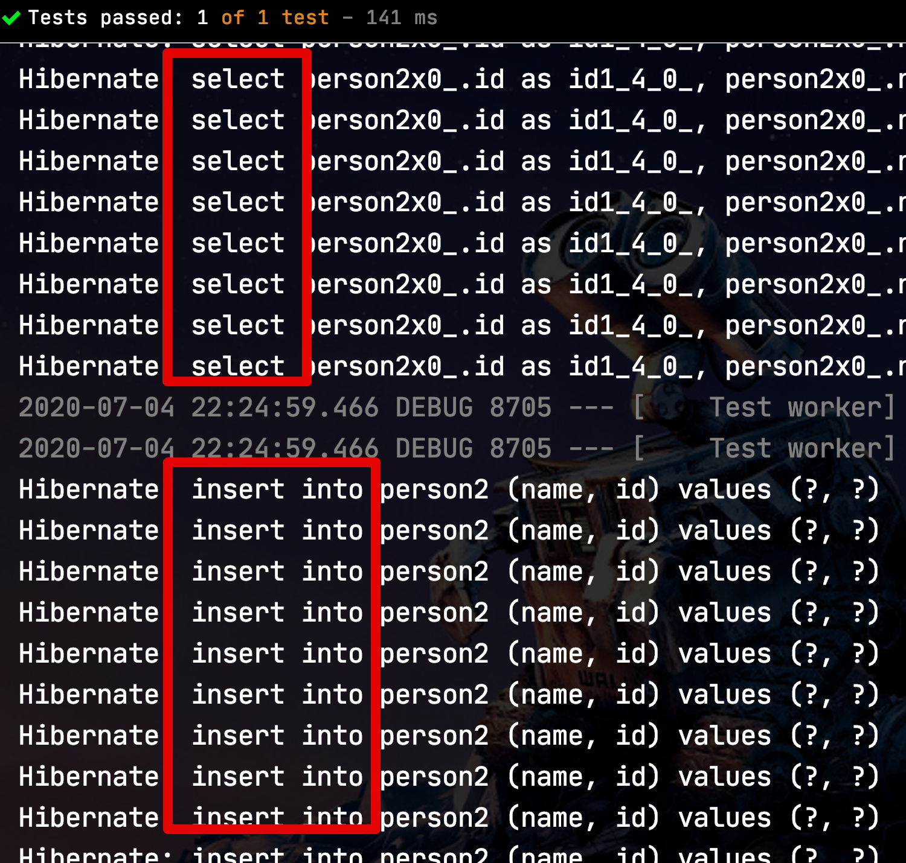
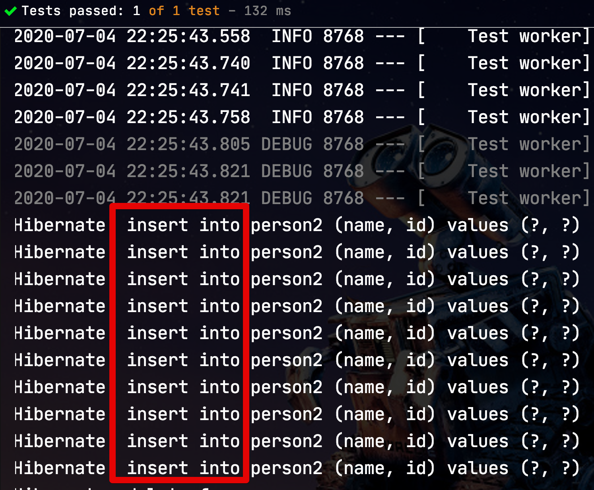
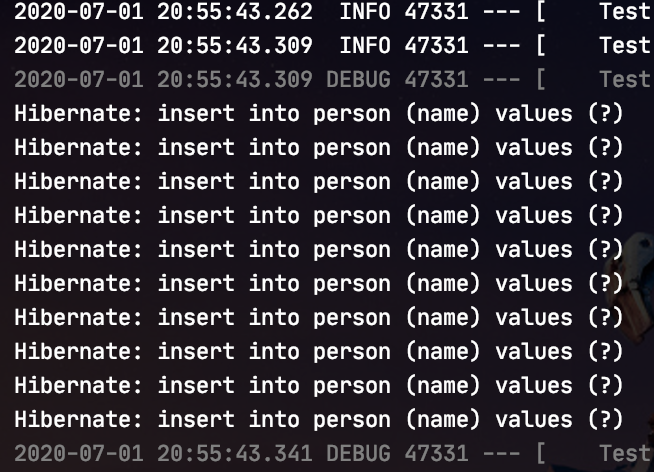
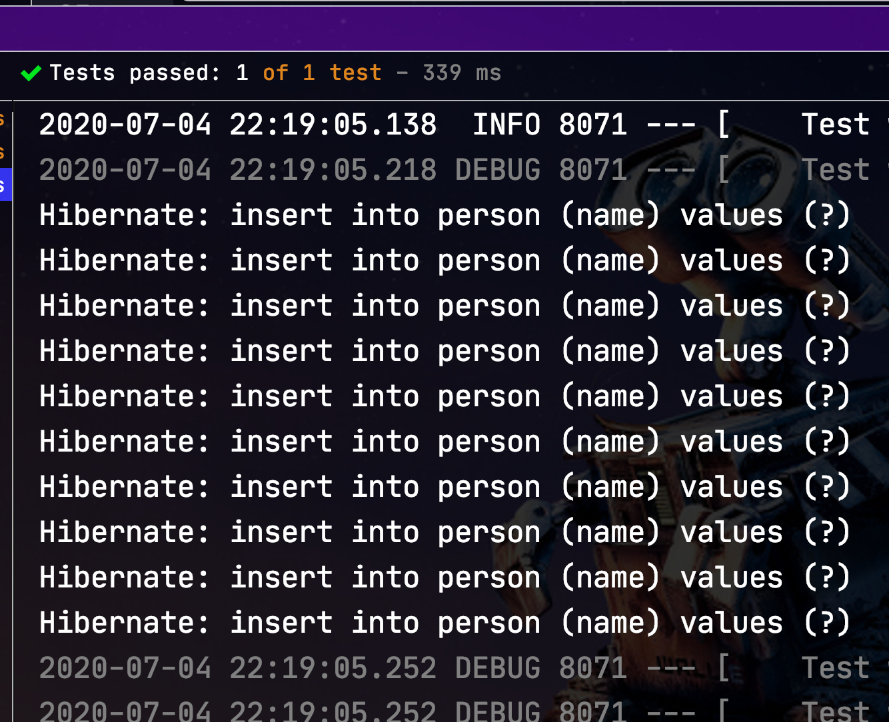

# Spring Batch JPA에서의 Write 비교

대규모 데이터를 처리하는 Spring Batch 에서 배치 성능은 중요한 요소입니다.  
배치 성능에 있어서 튜닝 요소는 크게 2가지로 정리 될 수 있습니다.  

* Reader를 통한 데이터 조회
* Writer를 통한 데이터 등록/수정

Reader의 경우엔 Select Query 튜닝을 통한 개선 이야기가 많이 공유되어있습니다.

> Querydsl을 통한 Paging, No Offset 조회 방법은 [이전 포스팅](https://jojoldu.tistory.com/473) 을 참고하시면 됩니다.

반면 Writer의 경우에는 Reader에 비해서는 공유된 내용이 많지 않습니다.  
그래서 이번 시간에는 **Spring Batch**와 **JPA**를 사용하는 경우에 어떻게 개선할 수 있을지 실제 비교를 해가며 정리하였습니다.  
  
모든 테스트는 아래 환경에서 동일하게 수행하였습니다.

* AWS RDS Aurora r5.large
* Macbook Pro 
  * 32 GB RAM
  * 2.9 GHz Intel Core i7
  * MacOS Mojave 10.14.6

## 1. Merge vs Persist

JPA에서 **Merge는 Insert에서 비효율적**으로 작동을 합니다.  

> Merge는 Entity의 persistent 상태를 알 수 없거나 이미 저장된 것을 변경하는데 유용합니다.

다만, Spring Batch에서는 JpaItemWriter를 통한 write 작업이 신규 생성되는 Entity를 저장하는 기능과 기존 Entity의 값 변경 2영역에 모두 대응해야되어 ```Merge``` 를 기본 Mode로 구현하였습니다.  
  
그러던 중, [Spring Batch 4.2 버전](https://spring.io/blog/2019/09/17/spring-batch-4-2-0-rc1-is-released#faster-writes-with-the-code-jpaitemwriter-code)에 **선택적으로 Persist 모드**를 선택할 수 있도록 개편되었습니다.

> Spring Boot 2.2.8 부터 사용 가능합니다.

자 그럼 2가지 Mode에 대한 비교를 해보겠습니다.

### 1-1. Non Auto Increment

먼저 비교해볼 것은 **테이블의 ID 생성 전략이 없는 경우** 입니다.  
(즉, Auto Increment가 없는 상태)  
  
이는 **Id 채번을 애플리케이션에서 하는 경우**입니다.  
  
테스트 할 Entity 는 다음과 같습니다.

```java
@Getter
@NoArgsConstructor
@Entity
public class Person2 {

    @Id
    private Long id;

    private String name;

    public Person2(Long id, String name) {
        this.id = id;
        this.name = name;
    }
}
```

보시다시피 ```@Id``` 외에 ```@GeneratedValue(strategy)``` 를 선언하지 않은 상태입니다.  
  
해당 Entity에 대한 Merge 테스트 코드는 다음과 같습니다.

```java
@Test
public void non_auto_increment_test_merge() throws Exception {
    // given
    JpaItemWriter<Person2> writer = new JpaItemWriterBuilder<Person2>()
            .entityManagerFactory(this.entityManagerFactory)
            .build();

    writer.afterPropertiesSet();
    List<Person2> items = new ArrayList<>();
    for (long i = 0; i < TEST_COUNT; i++) {
        items.add(new Person2(i, "foo" + i));
    }

    // when
    writer.write(items);
}
```

> Reader로 인한 조회 성능 차이나 그 밖에 Spring Batch의 여러 요소들로 인해 방해되는 것을 막기 위해 순수 Writer만 가지고 테스트를 진행합니다.

위 테스트 코드를 수행해보면?



**Select쿼리와 Insert쿼리가 함께 수행** 되는 것을 볼 수 있는데요.  
  
이는 Hibernate의 Merge 작동 방식때문인데요.  
기존에 해당 Id로 저장된 Entity가 있을 경우 Update를, 없을 경우엔 Insert를 실행하기 위하여 **저장하는 Entity 개수만큼 Select 쿼리가 발생**합니다.  
  
반대로 Persist에선 어떻게 작동할까요?  

아래와 같이 테스트 코드를 작성하여 실행해봅니다.  

```java
@Test
public void non_auto_increment_test_persist() throws Exception {
    // given
    JpaItemWriter<Person2> writer = new JpaItemWriterBuilder<Person2>()
            .usePersist(true) // (1)
            .entityManagerFactory(this.entityManagerFactory)
            .build();

    writer.afterPropertiesSet();
    List<Person2> items = new ArrayList<>();
    for (long i = 0; i < TEST_COUNT; i++) {
        items.add(new Person2(i, "foo" + i));
    }

    // when
    writer.write(items);
}
```

(1) ```.usePersist(true)```

* 글 상단에서 언급한것처럼 Spring Batch 4.2에서 도입된 ```persist``` 모드를 활성화하는 옵션입니다.

테스트 로그를 보면?



Merge와 달리 **Insert쿼리만 발생**한 것을 확인할 수 있습니다.  
  
자 그럼 이 둘의 실제 성능 차이는 얼마나 발생할까요?  

#### Non Auto Increment 성능 비교

**1만건**의 Entity를 AWS RDS Aurora (r5.large) 에 밀어넣어보면서 비교해보겠습니다.  
  
**1. Merge**


**2. Persist**


테스트 결과 **약 2배** (merge: 2m 16s, persist: 1m 9s) 의 성능 차이가 발생하는 것을 확인할 수 있습니다.  
  
Id 채번 전략이 별도로 없을 경우 Persist가 좋다는 것을 확인할 수 있습니다.

### 1-2. Auto Increment

자 그럼 반대로 Auto Increment가 선언 된 경우엔 어떻게 될까요?  
  
테스트에 사용될 Entity는 다음과 같습니다.

```java
@Getter
@NoArgsConstructor
@Entity
public class Person {

    @Id
    @GeneratedValue(strategy = GenerationType.IDENTITY)
    private Long id;

    private String name;

    public Person(String name) {
        this.name = name;
    }
}
```

가장 먼저 Merge에 대한 테스트 코드입니다.

```java
@Test
public void auto_increment_test_merge() throws Exception {
    // given
    JpaItemWriter<Person> writer = new JpaItemWriterBuilder<Person>()
            .entityManagerFactory(this.entityManagerFactory)
            .build();

    writer.afterPropertiesSet();
    List<Person> items = new ArrayList<>();
    for (long i = 0; i < TEST_COUNT; i++) {
        items.add(new Person( "foo" + i));
    }

    // when
    writer.write(items);

    // then
    assertThat(personRepository.count()).isEqualTo(TEST_COUNT);
}
```

이번 테스트부터는 **Id 생성을 Auto Increment에 맡기기 때문에** 직접 생성하지 않도록 하였습니다.  

위 코드를 실행해보면?



**추가 Select 쿼리 없이** Insert만 수행되는 것을 확인할 수 있습니다.  
지정된 Id가 없으니 명확하게 새로운 Entity 임을 알 수 있기 때문에 별도의 Select 쿼리가 발생하지 않았습니다.  
  
그럼 Persist는 어떻게 될까요?

```java
@Test
public void auto_increment_test_persist() throws Exception {
    // given
    JpaItemWriter<Person> writer = new JpaItemWriterBuilder<Person>()
            .usePersist(true)
            .entityManagerFactory(this.entityManagerFactory)
            .build();

    writer.afterPropertiesSet();
    List<Person> items = new ArrayList<>();
    for (long i = 0; i < TEST_COUNT; i++) {
        items.add(new Person( "foo" + i));
    }

    // when
    writer.write(items);

    // then
    assertThat(personRepository.count()).isEqualTo(TEST_COUNT);
}
```

Persist 테스트 코드를 수행해보면?  



마찬가지로 **Insert쿼리만 수행**되는 것을 확인할 수 있습니다.  

> Persist의 경우 **항상 새로운 객체를 저장할 때만** 사용해야 합니다.  
> Auto Increment에서 ID가 있는 Entity를 저장할 경우 에러가 발생합니다.

둘 사이에 쿼리가 차이가 없으니 실제로 성능비교를 한번 해보겠습니다.

#### Auto Increment 성능 비교

실제 발생하는 쿼리가 동일하니 성능 역시 비슷하게 나옵니다.

**1. Merge**


**2. Persist**


둘의 수행속도가 비슷하니 Auto Increment인 경우에 써도 되지 않을까? 싶으실텐데요.  
   
실제 Merge는 **Entity 복사**를 매번 수행합니다.  
PersistenceContext에 존재하는 것을 반환하거나 Entity의 새 인스턴스를 만듭니다.  
어쨌든 제공된 Entity에서 상태를 복사하고 관리되는 **복사본을 반환**합니다.  
(전달한 인스턴스는 관리되지 않습니다.)  
  
그래서 성능이 비슷하다 하더라도 신규 Entity를 사용할때는 Persist를 사용하는 것이 좋습니다.

## 2. Jdbc Batch Insert

위 테스트들을 거치면서 한가지 의문이 있으셨을 것입니다.  

* JpaItemWriter는 왜 Batch Insert (혹은 Bulk Insert) 로 처리하지 않는 것이지?  

일반적으로 Batch Insert라 하면 아래와 같은 쿼리를 이야기 합니다.

```sql
INSERT INTO person (name) VALUES
('name1'),
('name2'),
('name3');
```

이렇게 할 경우 MySQL 매커니즘으로 인해서 고성능으로 대량의 데이터를 처리할 수 있는데요.

> 실제 성능 비교를 아래에서 진행합니다.

JPA (정확히는 Hibernate) 에서는 **Auto Increment 일 경우엔 이 방식을 지원하지 않습니다**.  

물론 Auto Increment가 아닐 경우엔 아래와 같은 옵션으로 values 사이즈를 조절하여 Batch Insert를 사용할 수 있습니다.

```yml
spring.jpa.properties.hibernate.jdbc.batch_size=개수
```

* [jpa-hibernate-batch-insert-update](https://www.baeldung.com/jpa-hibernate-batch-insert-update)

이는 

* [Hibernate 공식문서](https://docs.jboss.org/hibernate/orm/5.4/userguide/html_single/Hibernate_User_Guide.html#batch-session-batch-insert)

그럼 ID 생성 전략을 Auto Increment가 아닌 Table (Sequence)를 선택하면 되지 않을까 생각하게 되는데요.  
아래 글에서 자세하게 설명하고 있지만, **성능상 이슈**와 **Dead Lock에 대한 이슈**로 Auto Increment를 강력하게 추천합니다.

* [Why you should never use the TABLE identifier generator with JPA and Hibernate](https://vladmihalcea.com/why-you-should-never-use-the-table-identifier-generator-with-jpa-and-hibernate/)

그래서 Batch Insert가 안된다고 하여 ID 생성 전략을 변경하는 것은 더 큰 위험이 발생할 수 있습니다.  
  

엔티티가 지속될 때마다 Hibernate는 엔티티의 Map 역할을하는 현재 실행중인 지속성 컨텍스트에이를 첨부해야합니다.  
Map 키는 엔티티 유형 (자바 클래스) 및 엔티티 ID로 구성됩니다.
IDENTITY 열의 경우 식별자 값을 알 수있는 유일한 방법은 SQL INSERT를 실행하는 것입니다.  
따라서 INSERT는 persist 메소드가 호출 될 때 실행되며 플러시 시간까지 비활성화 할 수 없습니다.
이러한 이유로 Hibernate는 IDENTITY 생성기 전략을 사용하여 엔티티에 대한 JDBC 일괄 삽입을 비활성화합니다.


### 3-1. 성능 비교


> 혹시나 MySQL에서 실행중인 쿼리를 확인했을때 Batch Insert 쿼리가 아니라 단일 Insert 쿼리가 실행중이라면 Spring Boot의 Jdbc-url값에 ```rewriteBatchedStatements``` 옵션 (기본값이 ```false```) 이 ```true``` 인지 확인해보시면 좋습니다.
> 적용방법: ```jdbc:mysql:://DB주소:포트/스키마?rewriteBatchedStatements=true```


> 다만 한번에 몇개의 Insert Value를 만들지는 대상이 되는 MySQL의 ```max_allowed_packet```, ```Buffer Size```, ```bulk_insert_buffer_size``` 등 여러 옵션들에 따라 상이하니 적절한 성능 테스트를 통해 값을 찾아야 합니다.

## 3. 최종 비교

| ItemWriter Mode   | Non Auto Increment | Auto Increment |
|-------------------|--------------------|----------------|
| Jpa.Merge         | 2m 16s             | 1m 1s          |
| Jpa.Persist       | 1m 9s              | 1m 2s          |
| Jdbc Batch Insert | 0.586s             | 0.586s         |


* 부모 Entity는 JpaItemWriter를 이용하여 ChunkSize별로 저장하여 PK값과 Entity를 확보
* PK가 확보된 부모 Entity를 통해 자식 Entity들을 생성 (부모 ID값을 갖고 생성)
* 자식 Entity들은 JdbcItemWriter를 통해 Bulk Insert