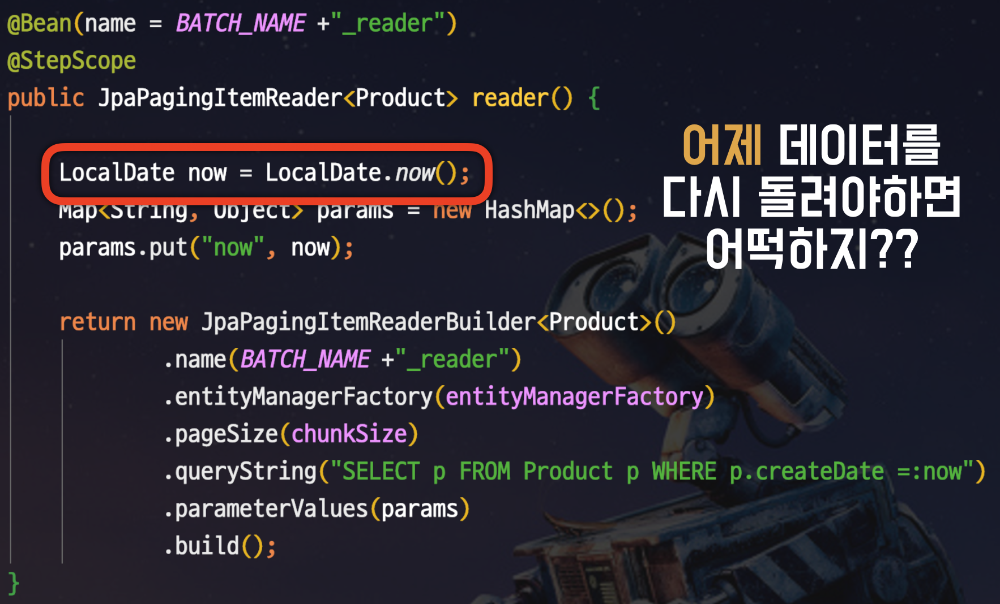
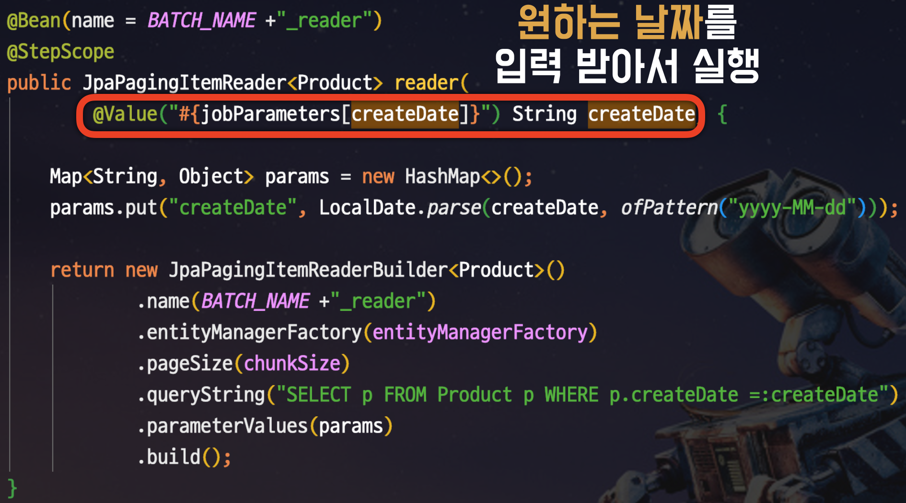

# Spring Batch의 멱등성 유지하기

프로그래밍 세계에서 자주 사용되는 단어 중에 **멱등성** 이 있습니다.  
이 멱등성을 한마디로 정의 하면
  
**연산을 여러번 적용하더라도 결과가 달라지지 않는 성질**  
  
입니다.  
  
> 참고: [idempotent-rest-apis](https://restfulapi.net/idempotent-rest-apis/)

Spring Batch를 코드를 구현하다보면 **시간** 데이터가 필요할 때가 있습니다. 
대표적으로 다음과 같은 경우들입니다.

* 매일 한번 **어제** 매출 데이터를 집계해야할 때
* **현재 시간**을 기준으로 유효기간이 만료된 포인트를 정리할 때
* 매일 한번 **오늘**을 기준으로 휴면회원 처리를 할 때

등등 **실행되는 시간을 기준**으로 데이터를 조회하고 처리해야할 경우가 많습니다.  
이럴때 가장 흔하게 사용되는 방법이 ```LocalDate.now()``` 혹은 ```LocalDateTime.now()``` 입니다.  
  
예시로 아래와 같이 **오늘** 날짜를 기준으로 데이터를 처리하는 배치 코드입니다.

```java
@Bean(name = BATCH_NAME +"_reader")
@StepScope
public JpaPagingItemReader<Product> reader() {

    LocalDate now = LocalDate.now();
    Map<String, Object> params = new HashMap<>();
    params.put("now", now);

    return new JpaPagingItemReaderBuilder<Product>()
            .name(BATCH_NAME +"_reader")
            .entityManagerFactory(entityManagerFactory)
            .pageSize(chunkSize)
            .queryString("SELECT p FROM Product p WHERE p.createDate =:now")
            .parameterValues(params)
            .build();
}
```

평소에는 별 문제가 없지만, 갑자기 이슈가 발생해서 **어제 데이터를 다시 처리**할 필요가 생긴 것이죠.   



이렇게 되면 해결책은 단 하나 뿐입니다.  

* 코드를 **임시 수정** & **임시 배포**해서
* 배치를 돌리고
* **다시 롤백**한다.





