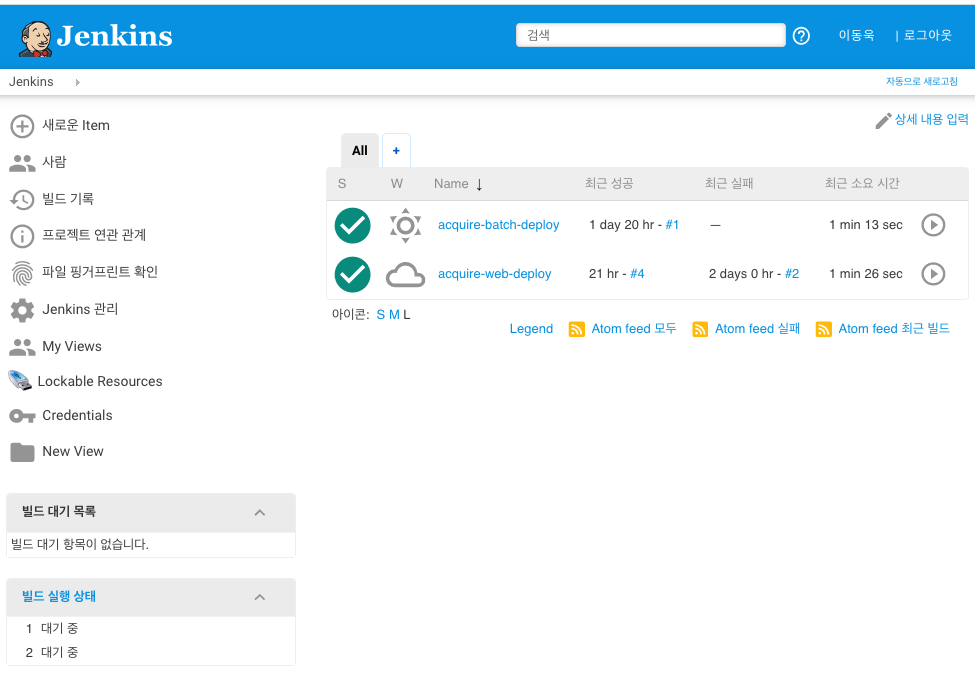
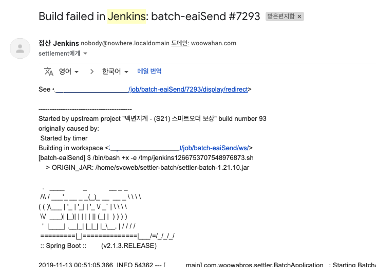
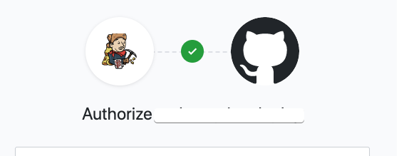

# Spring Batch 관리 도구로서의 Jenkins

Spring Batch는 아직까지 **표준 관리 도구**로 불리는 도구는 없습니다.  
각 팀/회사마다 상이한 방법들을 사용합니다.  
대표적인 방법들은 아래와 같습니다.

* Cron
* 본인이 직접 만든 어드민
* Spring Batch Admin
  * **Deprecated** 되었습니다.
    * 더이상 개선하지 않겠다고 합니다.
  * **Spring Cloud Data Flow** 로 전환하라고 합니다.
    * [참고](https://github.com/spring-attic/spring-batch-admin)
* Quartz + 직접 만든 Admin
  * Scheduler 역할로 Quartz를 사용하고 그에 대한 UI 대시보드를 직접 만드는 경우입니다.
  * [참고](https://kingbbode.tistory.com/38)
* CI 서비스 (Jenkins / Teamcity 등등)

> Spring Cloud Data Flow는 아직 실무에서 써보질 않아서 비교대상에 넣질 못했습니다.  
> 하나씩 테스트 중인데 정리가 어느정도 되면 블로그에 공유하겠습니다.  

인터넷을 돌아다니다보면 아직까지 Spring Batch Admin 에 대해 언급되거나 직접 어드민 페이지를 만들어 스프링 배치를 관리하는 글을 보게 됩니다.  
  
그래서 이번 글에서는 스프링 배치 관리도구로 CI 서비스들을 쓰면 어떤 장점이 있는지 소개하겠습니다.  

> ps. Spring Cloud Data Flow가 국내에서 좀 더 활성화가 많이 되는 시기가 온다면 그땐 이 글이 필요 없을 수도 있습니다.  
> 하지만 현재는 Spring Cloud Data Flow가 국내에 활성화가 안된 상태라 자료나 커뮤니티가 거의 없다고 보시면 됩니다.
  

## 1. Jenkins?

Jenkins는 Java 진영의 대표적인 CI 툴로 대부분의 경우에 배포 용도로 사용됩니다.  
그러다보니 배치에서도 Jenkins를 써야된다고 하면 거부감이 들기 마련입니다.  
  
보통 그런 거부감은 **배포하는 서비스가 배치를 다룬다**라는 것 때문에 생기는데요.  
그래서 저 같은 경우 **Jenkins 2대**를 각각 개별 서버에서 격리되어 관리되도록 구성해서 사용하기도 합니다.  
(ex: 배포 jenkins는 DB에 대한 권한을 제거하고, 배치 jenkins는 배포 권한을 제거하는 등)


(참고: [배포 Jenkins에서 배치 Jenkins로 Spring Batch 배포하기](https://jojoldu.tistory.com/313))

그럼 Spring Batch의 관리 도구로 Jenkins가 어떤 장/단점이 있는지 확인해보겠습니다.

## 2. 장점

먼저 Jenkins의 장점을 소개합니다.  
(여러 장점들이 있지만, 이 중 Spring Batch의 관리도구로서 체감되는 장점들만 소개드립니다.)

### 2-1. 기본적인 관리 기능



* 기본적인 관리자 페이지 기능
  * 실행 이력
  * 로그 관리
  * Dashboard
  * 계정 관리

이런 장점들로 인해 얻는 가장 큰 장점은 **추가 개발 공수가 필요하지 않습니다**.

### 2-2. Integration

여러 소프트웨어와의 통합 환경이 잘 구축 되어있습니다.  


**Email**



**Slack**


**Github**

특히 Github의 경우 Repository 연동 뿐만 아니라 **로그인도** OAuth로 연동이 가능합니다.



### 2-3. 다양한 Job 실행 환경


* 다양한 실행 방법 (Rest API / 스케줄링 / 수동 실행)

### 2-4. 풍부한 생태계

Java 진영에서 가장 오래되고 유명한 소프트웨어이다보니, 관련된 커뮤니티 / 자료 / 플러그인이 활성화가 되어있습니다.  
  
정말 별별 플러그인들이 다 있으며, 


    
### 2-5. 파이프라인

* 파이프라인
* 다양한 파이프라인 관리 방법
  * Web UI
  * Script
  * 둘다 사용 가능


#### 배치 애플리케이션 구조의 변화

위와 같은 CI 도구를 배치 관리자로 도입되면서 배치 애플리케이션 구현에도 많은 변화가 가능합니다.

* Job과 Step의 1:1 관계

* 기존에 Step으로 나눠진 작업들을 Job이 묶어주던 구조는

* Jenkins의 파이프라인이 각각의 Job을 묶어주는 구조로 변경


## 3. 단점

* 소수의 배치를 관리하기 위해 사용하기엔 과함
  * 2~3개의 배치만 필요한 상황에서는 부담스러운 면이 있습니다.

* 빈약한 실행 이력 관리
* 신뢰할 수 없는 플러그인
  * 대부분의 플러그인에 대해 Jenkins가 케어하지 않습니다.
  * 특히나 Jenkins 버전업시 사용못하는 경우가 빈번합니다.
* 플러그인 만들기가 쉬운편이 아닙니다.
  * Jenkins 플러그인 한번 만들어 보신 분들은 공감하실텐데, 진짜 복잡하고 과정이 많습니다.
    * 예전에 jcenter 나오기전에 mavencentral에 라이브러리 등록하는 과정을 떠올려 보시면 됩니다.
  * 다른 CI 도구들이 플러그인 등록 과정을 정말 쉽게 구현한 것과 비교하면 차이가 많이 납니다.
    * 그래도 플러그인 등록하는 분들이 계시니 참.. 애매하네요.

사실 위 3가지 단점은 이해할 수 있으나, 아래 단점들은 경우에 따라서 치명적일 수 있습니다.

### 3-1. 파일 기반의 설정 정보

* Jenkins는 Jenkins의 설정 정보를 비롯한, Job 실행 이력, Job 설정 정보등이 전부 **파일로 관리**됩니다.
* 그러다보니 설정 정보/실행 이력/현재 Job 정보등이 궁금하면 **무조건 API로만** 확인할 수 있습니다.
* 여러분이 웹 서비스를 만들었는데, DB로 데이터를 관리하지 않고, JSON 파일로 데이터를 관리한다고 생각하시면 됩니다.

### 3-2. 빈약한 검색 기능

* 위 단점인 "파일 기반의 설정 정보" 로 인해 발생하는 추가적인 단점1 입니다.
* 설정들이 다 파일로 되어있으니 **검색 기능이 파일 검색** 기반입니다.
* 많이들 사용하시는 소프트웨어인 Jira / Confluence / Logentries 등과 같은 검색 수준을 기대할 수가 없습니다.

### 3-3. 백업 & 이중화의 어려움

* 위 단점인 "파일 기반의 설정 정보" 로 인해 발생하는 추가적인 단점2 입니다.
* 파일 기반으로 구성되다보니 ```rsync``` 등으로 백업서버로 게속 동기화 하지 않는 이상은 **주기적으로 파일서버/S3/Github등으로 파일 업로드** 으로 백업하는 수 밖에 없습니다.
* 실시간 동기화가 아니기도하고, 업로드 실패나면 알람 받고 오류 확인해서 수정하는 등 **별도의 공수가 계속 필요합니다**
  * 대부분의 CI/CD 도구들은 이런 정보들을 **DB**로 관리합니다.
  * 장애나서 다시 복구해야될 경우 깡통 서버에 해당 CI/CD 도구 설치만하고 DB 주소 연결만 하면 즉시 복구됩니다.
  

## 4. 대안?

Jenkins가 나쁜 도구는 아니지만, 사람에 따라 위의 단점들이 치명적일 수 있습니다.  
그렇다고 Jenkins의 전체 구조 개편을 기다리기만 할수는 없겠죠.  
  
그래서 저 같은 경우엔 2가지를 대체제로 보고 시험해보고 있습니다.  

### 4-1. Teamcity

* Jetbrains의 CI 도구입니다.
* 파이프라인 / 스케줄링 등 Jenkins가 지원하는 대부분의 기능을 동일하게 지원합니다.
* Jetbrains 제품군 (IntelliJ, DataGrip, Upsource 등) 과 통합이 정말 잘 지원됩니다.
  * Job 알람에 대해 IntelliJ에서 알람이 보여지는 등
* 제일 큰 장점은 **설정 정보들이 DB로 관리**되고 있습니다.
  * 백업/이중화는 DB만 이루어지면 됩니다. 
    * Teamcity는 어디든 설치만해서 바로 DB 연결만 하면 똑같은 Teamcity 환경이 구성됩니다.
  * 당연히 별도의 기능이 필요한 경우 API를 사용해도 되고, 직접 Teamcity 설정 정보를 담고 있는 DB에 Query를 날려서 사용해도 됩니다.
* 단점은
  * Jenkins UI와 사용성에 익숙하신 분들에겐 굉장히 어색합니다.
  * 일정 규모이상에서는 유료 플랜이 필요합니다.
  * 결국은 CI/CD 도구이다보니 배치쪽으로 초점이 잡혀있진 않습니다.
  * 플러그인 생태계가 Jenkins에 비해 약합니다.
    * 그럼에도 Github 로그인 / 슬랙 연동 등 대부분의 플러그인들은 존재합니다.
  
### 4-2. Spring Cloud Data Flow

* Spring에서 공식적으로 밀고 있는 Batch/Data Stream 매니저입니다.
* Spring에서 대놓고 Batch/Data Stream 매니저로 나온 도구라서 발전 방향이 명확합니다.
* Teamcity와 마찬가지로 DB에 여러 설정 정보들을 관리합니다.
  * 별도로 지정하지 않으면 인메모리 DB (H2)를 사용합니다.
* 오픈소스이다보니 유료 플랜 걱정이 없습니다.
* 단점은
  * **CloudFoundry 혹은 Kubernates 환경**이 아니면 제대로 활용하기가 어렵습니다.
    * 일단 저 둘의 환경에서만 **스케줄링 기능을 사용 할 수 있습니다**
    * 즉, 단일 서버에서 설치만 해서는 스케줄링 기능을 못 쓴다는 것입니다.
    * 컨셉 자체가 **배치가 실행될때만 컨테이너를 별도로 생성해서 실행하고 종료**하기 위함이라 컨테이너 오케스트레이션 없이 사용하려면 굉장히 제한적입니다.
  * 당연히 위 단점으로 인해 **허들이 다른 어떤 도구들 보다 높습니다**
    * Cloud Native Batch Application 을 위해 나온 서비스라 클라우드를 굉장히 단순하게만 사용하는 그룹에서 사용하기엔 초기 허들이 높습니다.
  * IDC 환경에서 단일 서버로만 배치 환경을 구성해서 쓰실 분들은 선택지에서 제외하는게 낫습니다.
    * 단일 서버에 Kubernates 설치하고 그 서버안에서 Docker 생성&삭제를 하도록 하는건 거의 무의미합니다.


## 5. 마무리

직접 배치 관리 도구를 만드시는 분들은 **위 장점들을 직접 다 구현할 수 있을지** 한번은 고민해보시면 좋습니다.  
  
특히나 **파이프라인** 기능은 소수의 몇명이 구현하기에는 사이즈가 너무 큽니다.  
모든 비용 중에 가장 큰 비용은 **인건비**입니다.  

> 같은 의견으로 사내 프레임워크 만든다고 하면 저는 거의 실패한다고 생각하고 반대의견을 가집니다.  
> 사내 프레임워크 만들 공수와 인력으로 차라리 오픈소스에 투자하는게 훨씬 낫다고 봅니다.
